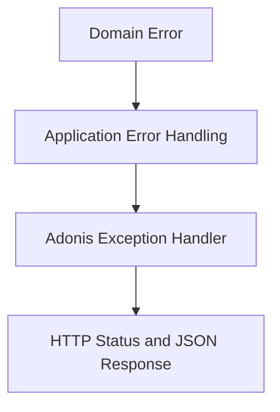

Use a **layered error model**: domain errors express violated business rules, application errors express use-case failures, and the Adonis HTTP layer maps both into a stable API response shape. This lets you stay clean architecturally while still giving clients predictable HTTP behavior.

## Recommended error design

### 1. Domain errors

Domain errors should represent **business truth violations**, not transport or framework concerns.

Examples:

- product already has maximum images
- order cannot transition from cancelled to shipped
- stock cannot go below zero

These errors should **not** know about:

- HTTP status codes
- Adonis response objects
- controller logic

A good domain error base concept is:

- `code`
- `message`
- optional `details`

Examples of domain error categories:

- `BusinessRuleViolationError`
- `EntityNotFoundError` only if not-found is a domain concept in your use case
- `InvalidStateTransitionError`
- `DuplicateEntityError`

For your current code, this raw generic exception in [`AddProductImageHandler.handle()`](src/kernel/product/application/command-handler/add_product_image_handler.ts:10) should become a domain or application-specific error instead of [`throw new Error()`](src/kernel/product/application/command-handler/add_product_image_handler.ts:22).

## 2. Application errors

Application errors sit one layer above the domain.

They describe use-case level failures such as:

- required dependency data was missing
- repository lookup failed to find an aggregate needed for a command
- caller is unauthorized for the use case
- a use case precondition failed before reaching domain logic

Typical application error categories:

- `UseCaseValidationError`
- `ResourceNotFoundError`
- `AuthorizationError`
- `ConcurrencyError`
- `ExternalServiceFailureError`

Application errors are still **not HTTP errors**. They are use-case outcomes.

## 3. Infrastructure errors

Infrastructure errors come from:

- database issues
- storage provider failures
- third-party services
- serialization failures

These should not leak raw low-level exceptions upward if avoidable. Wrap them in infrastructure-aware exceptions or convert them into application-level failures at the boundary.

For example, if upload fails in [`MediaUploadService.uploadFile()`](src/core/application/services/media-upload/media_upload_service.ts:36), you may eventually map that into an application-facing `ExternalServiceFailureError` rather than exposing low-level provider internals.

## 4. HTTP/API errors

Only the outermost Adonis layer should know how to convert errors into:

- status code
- JSON body
- logging policy

This mapping belongs in [`app/exceptions/handler.ts`](app/exceptions/handler.ts), not inside handlers or domain entities.

## Clean layered model



## Practical structure to adopt

A clean structure would be:

- `src/shared/domain/errors/`
- `src/shared/application/errors/`
- optionally `src/shared/infrastructure/errors/`

Example conceptual taxonomy:

### Domain

- `DomainError`
- `BusinessRuleViolationError`
- `EntityInvariantError`
- `InvalidStateTransitionError`

### Application

- `ApplicationError`
- `NotFoundApplicationError`
- `AuthorizationApplicationError`
- `ConflictApplicationError`
- `ValidationApplicationError`
- `ExternalDependencyApplicationError`

### Infrastructure

- `InfrastructureError`
- `PersistenceError`
- `StorageError`
- `MessageBusError`

## The simplest design that works well

If you want a clean but not overengineered model, use only two real bases:

- `DomainError`
- `ApplicationError`

Everything else extends those.

That is usually enough.

## Suggested behavior by layer

### Domain layer rules

Domain can:

- throw domain-specific errors
- expose machine-readable `code`
- include business-context data

Domain cannot:

- choose HTTP status
- choose JSON response structure
- import Adonis types

### Application layer rules

Application can:

- catch domain errors and rethrow as application errors where useful
- attach operation context
- unify repository or service failures into use-case semantics

Application should avoid:

- returning raw `Error`
- throwing generic `new Error` for expected failures

### Controller layer rules

Controllers should usually:

- validate input
- invoke command/query bus
- let exceptions bubble to the global exception handler

Controllers should avoid:

- bespoke try/catch for normal business failures
- manual status mapping everywhere

Your current pattern in [`AuthController.register()`](app/controllers/authentication/auth_controller.ts:6) using broad try/catch and [`response.abort()`](app/controllers/authentication/auth_controller.ts:20) is the kind of thing this approach replaces.

## Recommended error payload design

Every custom error should carry stable metadata such as:

- `name`
- `code`
- `message`
- optional `details`
- optional `cause`

The important field is `code`. Clients and the HTTP layer can rely on it more safely than free-form messages.

Example error semantics:

- `PRODUCT_IMAGE_LIMIT_REACHED`
- `ORDER_ALREADY_CANCELLED`
- `PRODUCT_NOT_FOUND`
- `CUSTOMER_ADDRESS_NOT_FOUND`
- `STORAGE_UPLOAD_FAILED`

## Mapping to HTTP in Adonis

Your Adonis exception handler in [`app/exceptions/handler.ts`](app/exceptions/handler.ts) should do centralized mapping.

Recommended mapping style:

- domain business rule violation -> `409` or `422`
- not found -> `404`
- authorization failure -> `403`
- authentication failure -> `401`
- validation failure -> `422`
- infrastructure dependency failure -> `502` or `503`
- unknown error -> `500`

### Practical API response shape

Use one consistent envelope, for example:

```text
{
  status: error,
  error: {
    code: PRODUCT_IMAGE_LIMIT_REACHED,
    message: Cannot add more images to this product,
    details: {...}
  }
}
```

This is much better than leaking random exception messages.

## Best practice for domain-first plus API mapping

### Domain example mindset

For a product image use case, do not throw:

- generic [`Error`](src/kernel/product/application/command-handler/add_product_image_handler.ts:22)

Throw something like:

- `ProductImageLimitReachedError`

That error belongs near the product domain or shared domain error package.

### Application example mindset

If a repository cannot find the product during a command, application may raise:

- `ProductNotFoundApplicationError`

or, if you consider product existence part of domain identity rules, a domain not-found variant.

### HTTP mapping example mindset

Then [`app/exceptions/handler.ts`](app/exceptions/handler.ts) maps:

- `ProductImageLimitReachedError` -> `409`
- `ProductNotFoundApplicationError` -> `404`

## Which errors belong where

### Domain error examples for your system

- product image limit reached
- insufficient stock
- invalid order status transition
- cannot remove main image unless replacement exists

### Application error examples

- product requested by command does not exist
- customer address not found for checkout flow
- upload provider unavailable during image association workflow
- command handler dependency failed

### Infrastructure error examples

- database deadlock
- storage timeout
- S3 credential failure
- broken serialization or query failure

## Important distinction: expected vs unexpected failures

Expected failures:

- business rules
- missing resources
- invalid state transitions
- authorization failure

These should use custom typed errors.

Unexpected failures:

- programming bugs
- null dereference
- container misconfiguration
- unhandled runtime exceptions

These should bubble as unknown errors and become `500` responses with logging.

Do not try to make every exception a business error.

## A very practical pattern for your codebase

Given your current architecture, I recommend this pattern:

### Step 1

Create shared base classes:

- `DomainError`
- `ApplicationError`

### Step 2

Give each one:

- `code`
- `message`
- `details`
- optional `cause`

### Step 3

Create module-specific errors where business rules live
Examples:

- `ProductImageLimitReachedError`
- `InvalidOrderStatusTransitionError`
- `InsufficientStockError`

### Step 4

Use those in handlers instead of generic errors
This directly improves places like [`AddProductImageHandler.handle()`](src/kernel/product/application/command-handler/add_product_image_handler.ts:10).

### Step 5

Centralize HTTP mapping in [`app/exceptions/handler.ts`](app/exceptions/handler.ts)
No controller-specific ad hoc mapping unless truly special.

## Decision rule for choosing domain vs application error

Use this test:

### It is a domain error if:

- it expresses a business invariant
- it would still exist even if there were no HTTP API
- it belongs to the ubiquitous language of the business

### It is an application error if:

- it belongs to use-case orchestration
- it coordinates dependencies or access rules
- it is not itself a business invariant

Example:

- `Cannot add more than 3 images to a product` -> domain error
- `Product with this id was not found while executing add image command` -> application error in many systems

## Recommended status mapping policy

A practical mapping policy is:

- `DomainError` default -> `409`
- `ApplicationError` default -> `422`
- specific not found subclass -> `404`
- authorization subclass -> `403`
- unknown -> `500`

You can refine later, but this is enough to start.

## What to avoid

Avoid these patterns:

- `throw new Error some message`
- low-level DB error messages returned to clients
- controllers catching every use-case error individually
- domain errors importing Adonis exceptions
- one giant `AppError` class for every possible concern

## Best approach for your project

The best fit for this codebase is:

- domain-first error classes for business invariants
- application error classes for orchestration and not-found scenarios
- centralized Adonis mapping in [`app/exceptions/handler.ts`](app/exceptions/handler.ts)
- stable `code` values for API consumers

## Minimal plan to implement later

- [ ] Add base [`DomainError`](src/shared/domain/errors/domain_error.ts:1) and [`ApplicationError`](src/shared/application/errors/application_error.ts:1)
- [ ] Add module-specific errors for product, stock, and order flows
- [ ] Replace generic throws in handlers such as [`AddProductImageHandler.handle()`](src/kernel/product/application/command-handler/add_product_image_handler.ts:10)
- [ ] Update [`app/exceptions/handler.ts`](app/exceptions/handler.ts) to map typed errors into consistent HTTP JSON
- [ ] Remove ad hoc controller error responses like [`response.abort()`](app/controllers/authentication/auth_controller.ts:20)

This gives you clean architecture internally and predictable API behavior externally.
