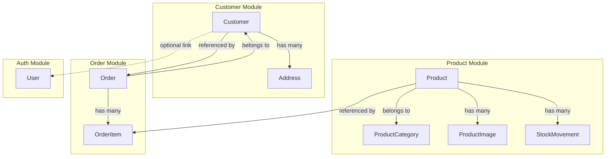
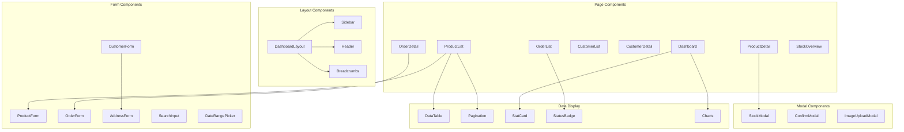

# E-Commerce Frontend Dashboard Architecture

## System Overview

This document outlines the structure for a frontend dashboard application that interfaces with the e-commerce backend API. The dashboard provides administrative capabilities for managing products, customers, orders, and inventory.

---

## Module Relationships & Data Flow



### Entity Relationships Summary

| Entity | Relationships | Key Fields |
|--------|---------------|------------|
| **Product** | Belongs to Category, Has main Image, Has many Images, Has Stock movements | id, designation, slug, price, stockQuantity, categoryId, mainImageId |
| **ProductCategory** | Has many Products | id, designation, slug, type, parentId |
| **Customer** | Has many Addresses, Has many Orders | id, firstName, lastName, email, phone, userId |
| **Address** | Belongs to Customer | id, customerId, type, addressLine1, city, country, isDefault |
| **Order** | Belongs to Customer, Has many OrderItems | id, orderNumber, customerId, status, total, shippingAddress |
| **OrderItem** | Belongs to Order | id, orderId, productId, productName, quantity, unitPrice |
| **StockMovement** | Belongs to Product | id, productId, operationType, quantity, reason |

---

## Dashboard Architecture

### Tech Stack Recommendation

| Layer | Technology |
|-------|------------|
| Framework | React 18+ or Vue 3 |
| Language | TypeScript |
| State Management | TanStack Query (React Query) + Zustand/Context |
| UI Components | shadcn/ui, Ant Design, or Material-UI |
| Forms | React Hook Form + Zod |
| Routing | React Router v6 |
| HTTP Client | Axios |
| Charts | Recharts or Chart.js |
| Date Handling | date-fns |

---

## Folder Structure

```
src/
├── api/                          # API layer
│   ├── client.ts                 # Axios instance
│   ├── interceptors.ts           # Request/response interceptors
│   ├── endpoints/
│   │   ├── auth.ts               # Authentication endpoints
│   │   ├── products.ts           # Product endpoints
│   │   ├── categories.ts         # Category endpoints
│   │   ├── stock.ts              # Stock management endpoints
│   │   ├── customers.ts          # Customer endpoints
│   │   ├── addresses.ts          # Address endpoints
│   │   └── orders.ts             # Order endpoints
│   └── types/
│       └── api-responses.ts      # Common API response types
│
├── types/                        # Global TypeScript types
│   ├── models/
│   │   ├── product.ts
│   │   ├── category.ts
│   │   ├── customer.ts
│   │   ├── address.ts
│   │   ├── order.ts
│   │   ├── order-item.ts
│   │   ├── stock-movement.ts
│   │   └── user.ts
│   └── enums/
│       ├── order-status.ts
│       ├── address-type.ts
│       └── stock-operation.ts
│
├── hooks/                        # Custom React hooks
│   ├── queries/                  # TanStack Query hooks
│   │   ├── use-products.ts
│   │   ├── use-customers.ts
│   │   ├── use-orders.ts
│   │   └── use-stock.ts
│   ├── mutations/
│   │   ├── use-create-product.ts
│   │   ├── use-update-order-status.ts
│   │   └── ...
│   └── use-auth.ts
│
├── components/                   # Reusable components
│   ├── layout/
│   │   ├── dashboard-layout.tsx
│   │   ├── sidebar.tsx
│   │   ├── header.tsx
│   │   └── breadcrumbs.tsx
│   ├── ui/                       # Base UI components
│   │   ├── data-table/
│   │   │   ├── data-table.tsx
│   │   │   ├── pagination.tsx
│   │   │   └── sorting.tsx
│   │   ├── status-badge.tsx
│   │   ├── stat-card.tsx
│   │   ├── search-input.tsx
│   │   └── date-range-picker.tsx
│   └── forms/
│       ├── product-form.tsx
│       ├── customer-form.tsx
│       ├── order-form.tsx
│       └── address-form.tsx
│
├── pages/                        # Route pages
│   ├── auth/
│   │   ├── login.tsx
│   │   └── register.tsx
│   ├── dashboard/
│   │   └── index.tsx             # Dashboard overview
│   ├── products/
│   │   ├── index.tsx             # Product list
│   │   ├── new.tsx               # Create product
│   │   ├── [id].tsx              # Product detail
│   │   └── edit/[id].tsx         # Edit product
│   ├── categories/
│   │   ├── index.tsx
│   │   └── [id].tsx
│   ├── stock/
│   │   ├── index.tsx             # Stock overview
│   │   ├── low-stock.tsx         # Low stock alerts
│   │   └── [productId].tsx       # Product stock history
│   ├── customers/
│   │   ├── index.tsx             # Customer list
│   │   ├── new.tsx               # Create customer
│   │   ├── [id].tsx              # Customer detail
│   │   └── edit/[id].tsx         # Edit customer
│   └── orders/
│       ├── index.tsx             # Order list
│       ├── new.tsx               # Create order
│       ├── [id].tsx              # Order detail
│       └── edit/[id].tsx         # Update order status
│
├── stores/                       # State management
│   ├── auth-store.ts
│   └── ui-store.ts
│
├── lib/                          # Utilities
│   ├── utils.ts                  # General utilities
│   ├── formatters.ts             # Number/date formatters
│   └── validators.ts             # Zod schemas
│
└── config/                       # Configuration
    ├── routes.ts                 # Route definitions
    ├── navigation.ts             # Sidebar nav items
    └── constants.ts              # App constants
```

---

## Data Models (TypeScript Interfaces)

### Product Models

```typescript
// types/models/product.ts

export interface Product {
  id: string;
  slug: string;
  designation: string;
  description: string;
  price: number;
  brand: string;
  isAvailable: boolean;
  isDeleted: boolean;
  stockQuantity: number;
  lowStockThreshold: number;
  categoryId: string;
  categoryName?: string;
  category?: ProductCategory;
  mainImageId?: string;
  mainImageUrl?: string;
  mainImageAlt?: string;
  mainImageTitle?: string;
  images?: ProductImage[];
  createdAt: string;
  updatedAt: string;
}

export interface ProductImage {
  id: string;
  url: string;
  alt: string;
  title: string;
}

export interface ProductCategory {
  id: string;
  designation: string;
  slug: string;
  type: 'CATEGORY' | 'TAG';
  parentId?: string;
  createdAt: string;
  updatedAt: string;
}

// API Request/Response types
export interface CreateProductRequest {
  designation: string;
  description: string;
  categoryId: string;
  mainImageId: string;
  price: number;
  brand?: string;
  imageIds?: string[];
}

export interface UpdateProductRequest extends CreateProductRequest {}

export interface ProductListResponse {
  meta: PaginationMeta;
  data: Product[];
}

export interface GroupedProductsResponse {
  [categoryName: string]: Product[];
}
```

### Customer Models

```typescript
// types/models/customer.ts

export interface Customer {
  id: string;
  userId?: string;
  firstName: string;
  lastName: string;
  email?: string;
  phone: string;
  fullName: string; // computed: `${firstName} ${lastName}`
  addresses: Address[];
  createdAt: string;
  updatedAt: string;
}

export interface Address {
  id: string;
  customerId: string;
  type: 'shipping' | 'billing';
  addressLine1: string;
  addressLine2?: string;
  city: string;
  state?: string;
  postalCode?: string;
  country: string;
  isDefault: boolean;
  formattedAddress: string; // computed
  createdAt: string;
  updatedAt: string;
}

// API Request types
export interface CreateCustomerRequest {
  firstName: string;
  lastName: string;
  phone: string;
  email?: string;
  userId?: string;
}

export interface CreateAddressRequest {
  addressLine1: string;
  addressLine2?: string;
  city: string;
  state?: string;
  postalCode?: string;
  country: string;
  type: 'shipping' | 'billing';
  isDefault?: boolean;
}
```

### Order Models

```typescript
// types/models/order.ts
import { OrderStatus } from '../enums/order-status';

export interface Order {
  id: string;
  orderNumber: string;
  customerId: string;
  customerFirstName: string;
  customerLastName: string;
  customerPhone?: string;
  customerFullName: string; // computed
  status: OrderStatus;
  
  // Shipping Address
  shippingAddressLine1: string;
  shippingAddressLine2?: string;
  shippingCity: string;
  shippingState?: string;
  shippingPostalCode?: string;
  shippingCountry: string;
  formattedShippingAddress: string; // computed
  
  // Pricing
  subtotal: number;
  shippingFee: number;
  total: number;
  
  // Notes
  customerNotes?: string;
  adminNotes?: string;
  
  // Timestamps
  confirmedAt?: string;
  shippedAt?: string;
  deliveredAt?: string;
  cancelledAt?: string;
  createdAt: string;
  updatedAt: string;
  
  // Relationships
  items: OrderItem[];
}

export interface OrderItem {
  id: string;
  productId: string;
  productName: string;
  productSlug?: string;
  quantity: number;
  unitPrice: number;
  totalPrice: number;
}

// Enums
export enum OrderStatus {
  PENDING = 'PENDING',
  CONFIRMED = 'CONFIRMED',
  PROCESSING = 'PROCESSING',
  SHIPPED = 'SHIPPED',
  DELIVERED = 'DELIVERED',
  CANCELLED = 'CANCELLED'
}

// API Request types
export interface CreateOrderItemRequest {
  productId: string;
  quantity: number;
}

export interface CreateOrderRequest {
  customerId: string;
  items: CreateOrderItemRequest[];
  shippingAddressId: string;
  customerNotes?: string;
}

export interface UpdateOrderStatusRequest {
  status: OrderStatus;
  adminNotes?: string;
}

export interface CancelOrderRequest {
  reason?: string;
}
```

### Stock Models

```typescript
// types/models/stock-movement.ts

export interface StockMovement {
  id: string;
  productId: string;
  operationType: StockOperation;
  quantity: number;
  previousQuantity: number;
  newQuantity: number;
  reason?: string;
  createdAt: string;
}

export interface ProductStock {
  productId: string;
  quantity: number;
  lowStockThreshold: number;
  isLowStock: boolean;
  isOutOfStock: boolean;
}

export interface LowStockProduct {
  id: string;
  designation: string;
  slug: string;
  stockQuantity: number;
  lowStockThreshold: number;
}

export enum StockOperation {
  ADD = 'ADD',
  REMOVE = 'REMOVE',
  SET = 'SET'
}

// API Request types
export interface AddStockRequest {
  quantity: number;
  reason?: string;
}

export interface RemoveStockRequest {
  quantity: number;
  reason?: string;
}

export interface SetStockRequest {
  quantity: number;
  reason?: string;
}
```

### Common Types

```typescript
// types/models/common.ts

export interface PaginationMeta {
  total: number;
  perPage: number;
  currentPage: number;
  lastPage: number;
  firstPage: number;
  firstPageUrl: string;
  lastPageUrl: string;
  nextPageUrl?: string;
  previousPageUrl?: string;
}

export interface PaginatedResponse<T> {
  meta: PaginationMeta;
  data: T[];
}

export interface ApiError {
  status: 'error';
  message: string;
  errors?: Record<string, string[]>;
}

export interface ApiSuccess<T> {
  status: 'success';
  data: T;
  message?: string;
}
```

---

## Routing Structure

```typescript
// config/routes.ts

export const routes = {
  // Auth routes
  auth: {
    login: '/login',
    register: '/register',
  },
  
  // Dashboard
  dashboard: '/',
  
  // Product routes
  products: {
    list: '/products',
    new: '/products/new',
    detail: (id: string) => `/products/${id}`,
    edit: (id: string) => `/products/${id}/edit`,
    grouped: '/products/grouped',
  },
  
  // Category routes
  categories: {
    list: '/categories',
    new: '/categories/new',
    detail: (id: string) => `/categories/${id}`,
    edit: (id: string) => `/categories/${id}/edit`,
    products: (id: string) => `/categories/${id}/products`,
  },
  
  // Stock routes
  stock: {
    overview: '/stock',
    lowStock: '/stock/low-stock',
    history: (productId: string) => `/stock/${productId}/history`,
  },
  
  // Customer routes
  customers: {
    list: '/customers',
    new: '/customers/new',
    detail: (id: string) => `/customers/${id}`,
    edit: (id: string) => `/customers/${id}/edit`,
    addresses: (id: string) => `/customers/${id}/addresses`,
    orders: (id: string) => `/customers/${id}/orders`,
  },
  
  // Order routes
  orders: {
    list: '/orders',
    new: '/orders/new',
    detail: (id: string) => `/orders/${id}`,
    byNumber: (number: string) => `/orders/number/${number}`,
  },
} as const;
```

---

## Page Components Structure

### 1. Dashboard Overview Page

```typescript
// pages/dashboard/index.tsx

interface DashboardStats {
  totalProducts: number;
  lowStockCount: number;
  totalCustomers: number;
  totalOrders: number;
  ordersByStatus: Record<OrderStatus, number>;
  recentOrders: Order[];
  revenueToday: number;
  revenueThisMonth: number;
}

// Sections:
// - Stat cards (Products, Customers, Orders, Revenue)
// - Orders by status chart
// - Low stock alerts table
// - Recent orders table
```

### 2. Products List Page

```typescript
// pages/products/index.tsx

interface ProductListFilters {
  q?: string;
  categoryId?: string;
  isAvailable?: boolean;
  sort?: 'asc' | 'desc';
  page?: number;
  limit?: number;
}

// Sections:
// - Page header with "Add Product" button
// - Search and filters
// - Data table with columns: Image, Designation, Category, Price, Stock, Status, Actions
// - Pagination
// - Bulk actions
```

### 3. Product Detail Page

```typescript
// pages/products/[id].tsx

// Sections:
// - Product images gallery
// - Product information card (designation, description, price, brand)
// - Category info
// - Stock information card with actions
// - Stock history table
// - Related orders
```

### 4. Stock Management Pages

```typescript
// pages/stock/index.tsx
// pages/stock/low-stock.tsx
// pages/stock/[productId].tsx

// Features:
// - Stock overview with filters
// - Low stock alerts with quick actions
// - Stock history with operation type badges
// - Adjust stock modal (Add/Remove/Set)
```

### 5. Customers List Page

```typescript
// pages/customers/index.tsx

interface CustomerListFilters {
  q?: string;
  sort?: 'asc' | 'desc';
}

// Sections:
// - Page header with "Add Customer" button
// - Search bar
// - Data table with columns: Name, Email, Phone, Address Count, Orders Count, Actions
// - Pagination
```

### 6. Customer Detail Page

```typescript
// pages/customers/[id].tsx

// Sections:
// - Customer info card
// - Addresses list with add/edit/delete
// - Order history
// - Statistics (total orders, total spent)
```

### 7. Orders List Page

```typescript
// pages/orders/index.tsx

interface OrderListFilters {
  status?: OrderStatus;
  customerId?: string;
  dateFrom?: string;
  dateTo?: string;
  q?: string;
}

// Sections:
// - Page header with "Create Order" button
// - Status filter tabs (All, Pending, Confirmed, Processing, Shipped, Delivered, Cancelled)
// - Date range filter
// - Search by order number or customer
// - Data table with columns: Order #, Customer, Status, Total, Date, Actions
// - Pagination
```

### 8. Order Detail Page

```typescript
// pages/orders/[id].tsx

// Sections:
// - Order header with status badge and actions
// - Order timeline (status history)
// - Customer info card
// - Shipping address card
// - Order items table with product details
// - Pricing breakdown (Subtotal, Shipping, Total)
// - Notes section (customer + admin)
// - Update status workflow
```

---

## Component Hierarchy



---

## API Integration Patterns

### TanStack Query Hooks Structure

```typescript
// hooks/queries/use-products.ts

import { useQuery, useMutation, useQueryClient } from '@tanstack/react-query';
import { productsApi } from '@/api/endpoints/products';

const PRODUCTS_KEY = 'products';

// List products with filters
export function useProducts(filters: ProductListFilters) {
  return useQuery({
    queryKey: [PRODUCTS_KEY, filters],
    queryFn: () => productsApi.list(filters),
  });
}

// Single product
export function useProduct(id: string) {
  return useQuery({
    queryKey: [PRODUCTS_KEY, id],
    queryFn: () => productsApi.get(id),
    enabled: !!id,
  });
}

// Grouped by category
export function useProductsGrouped() {
  return useQuery({
    queryKey: [PRODUCTS_KEY, 'grouped'],
    queryFn: () => productsApi.groupedByCategory(),
  });
}

// Create product mutation
export function useCreateProduct() {
  const queryClient = useQueryClient();
  
  return useMutation({
    mutationFn: productsApi.create,
    onSuccess: () => {
      queryClient.invalidateQueries({ queryKey: [PRODUCTS_KEY] });
    },
  });
}

// Update product mutation
export function useUpdateProduct() {
  const queryClient = useQueryClient();
  
  return useMutation({
    mutationFn: ({ id, data }: { id: string; data: UpdateProductRequest }) =>
      productsApi.update(id, data),
    onSuccess: (_, { id }) => {
      queryClient.invalidateQueries({ queryKey: [PRODUCTS_KEY, id] });
      queryClient.invalidateQueries({ queryKey: [PRODUCTS_KEY] });
    },
  });
}
```

### API Endpoint Pattern

```typescript
// api/endpoints/products.ts

import { apiClient } from '../client';
import { Product, ProductListResponse, CreateProductRequest, UpdateProductRequest } from '@/types/models/product';

export const productsApi = {
  list: async (filters: ProductListFilters): Promise<ProductListResponse> => {
    const response = await apiClient.get('/products', { params: filters });
    return response.data;
  },
  
  get: async (id: string): Promise<Product> => {
    const response = await apiClient.get(`/products/${id}`);
    return response.data.data;
  },
  
  create: async (data: CreateProductRequest): Promise<void> => {
    await apiClient.post('/products', data);
  },
  
  update: async (id: string, data: UpdateProductRequest): Promise<void> => {
    await apiClient.put(`/products/${id}`, data);
  },
  
  groupedByCategory: async (): Promise<GroupedProductsResponse> => {
    const response = await apiClient.get('/products/grouped-by-category');
    return response.data;
  },
};
```

---

## State Management

### Authentication State

```typescript
// stores/auth-store.ts

import { create } from 'zustand';
import { persist } from 'zustand/middleware';

interface User {
  id: string;
  email: string;
  name: string;
}

interface AuthState {
  user: User | null;
  token: string | null;
  isAuthenticated: boolean;
  login: (token: string, user: User) => void;
  logout: () => void;
}

export const useAuthStore = create<AuthState>()(
  persist(
    (set) => ({
      user: null,
      token: null,
      isAuthenticated: false,
      login: (token, user) => set({ token, user, isAuthenticated: true }),
      logout: () => set({ token: null, user: null, isAuthenticated: false }),
    }),
    { name: 'auth-storage' }
  )
);
```

### UI State

```typescript
// stores/ui-store.ts

import { create } from 'zustand';

interface UIState {
  sidebarOpen: boolean;
  toggleSidebar: () => void;
  
  notifications: Notification[];
  addNotification: (notification: Notification) => void;
  removeNotification: (id: string) => void;
}

export const useUIStore = create<UIState>((set) => ({
  sidebarOpen: true,
  toggleSidebar: () => set((state) => ({ sidebarOpen: !state.sidebarOpen })),
  
  notifications: [],
  addNotification: (notification) =>
    set((state) => ({
      notifications: [...state.notifications, notification],
    })),
  removeNotification: (id) =>
    set((state) => ({
      notifications: state.notifications.filter((n) => n.id !== id),
    })),
}));
```

---

## Form Validation Schemas (Zod)

```typescript
// lib/validators.ts

import { z } from 'zod';
import { OrderStatus } from '@/types/enums/order-status';

export const productSchema = z.object({
  designation: z.string().min(2, 'Designation must be at least 2 characters'),
  description: z.string().min(10, 'Description must be at least 10 characters'),
  categoryId: z.string().uuid('Please select a category'),
  mainImageId: z.string().uuid('Please select a main image'),
  price: z.number().positive('Price must be positive'),
  brand: z.string().optional(),
  imageIds: z.array(z.string().uuid()).max(2).optional(),
});

export const customerSchema = z.object({
  firstName: z.string().min(2, 'First name must be at least 2 characters'),
  lastName: z.string().min(2, 'Last name must be at least 2 characters'),
  phone: z.string().min(10, 'Phone must be at least 10 characters'),
  email: z.string().email('Invalid email').optional(),
});

export const addressSchema = z.object({
  addressLine1: z.string().min(5, 'Address is required'),
  addressLine2: z.string().optional(),
  city: z.string().min(2, 'City is required'),
  state: z.string().optional(),
  postalCode: z.string().optional(),
  country: z.string().min(2, 'Country is required'),
  type: z.enum(['shipping', 'billing']),
  isDefault: z.boolean().optional(),
});

export const orderItemSchema = z.object({
  productId: z.string().uuid(),
  quantity: z.number().int().min(1).max(1000),
});

export const createOrderSchema = z.object({
  customerId: z.string().uuid('Please select a customer'),
  items: z.array(orderItemSchema).min(1, 'At least one item is required'),
  shippingAddressId: z.string().uuid('Please select a shipping address'),
  customerNotes: z.string().max(1000).optional(),
});

export const updateOrderStatusSchema = z.object({
  status: z.nativeEnum(OrderStatus),
  adminNotes: z.string().max(1000).optional(),
});
```

---

## Navigation Structure

```typescript
// config/navigation.ts

import { routes } from './routes';

export interface NavItem {
  label: string;
  icon: string;
  href: string;
  children?: NavItem[];
  badge?: number | string;
}

export const mainNavigation: NavItem[] = [
  {
    label: 'Dashboard',
    icon: 'LayoutDashboard',
    href: routes.dashboard,
  },
  {
    label: 'Products',
    icon: 'Package',
    href: routes.products.list,
    children: [
      { label: 'All Products', icon: 'List', href: routes.products.list },
      { label: 'Categories', icon: 'Tags', href: routes.categories.list },
      { label: 'Stock Management', icon: 'Warehouse', href: routes.stock.overview },
      { label: 'Low Stock Alerts', icon: 'AlertTriangle', href: routes.stock.lowStock },
    ],
  },
  {
    label: 'Customers',
    icon: 'Users',
    href: routes.customers.list,
  },
  {
    label: 'Orders',
    icon: 'ShoppingCart',
    href: routes.orders.list,
  },
];

export const userNavigation: NavItem[] = [
  { label: 'Profile', icon: 'User', href: '/profile' },
  { label: 'Settings', icon: 'Settings', href: '/settings' },
  { label: 'Logout', icon: 'LogOut', href: '/logout' },
];
```

---

## Key Features Summary

### Product Management
- [ ] List products with search, filter, sort, pagination
- [ ] Create/Edit product with image upload
- [ ] View product details with images
- [ ] Manage product categories
- [ ] Stock management (add/remove/set stock)
- [ ] Low stock alerts dashboard
- [ ] Stock movement history

### Customer Management
- [ ] List customers with search
- [ ] Create/Edit customer profiles
- [ ] View customer details
- [ ] Manage customer addresses
- [ ] View customer order history

### Order Management
- [ ] List orders with status filters
- [ ] Create new orders
- [ ] View order details
- [ ] Update order status workflow
- [ ] Cancel orders with reason
- [ ] Print order invoices
- [ ] Order timeline/history

### Dashboard Analytics
- [ ] Key metrics cards (products, customers, orders, revenue)
- [ ] Orders by status chart
- [ ] Low stock alerts widget
- [ ] Recent orders widget
- [ ] Revenue trends

---

## Implementation Phases

### Phase 1: Foundation
1. Project setup with routing and state management
2. Authentication (login/logout)
3. Dashboard layout with sidebar navigation
4. API client setup with interceptors

### Phase 2: Product Module
1. Product list page
2. Product create/edit forms
3. Product detail page
4. Category management
5. Image upload integration

### Phase 3: Stock Management
1. Stock overview page
2. Stock adjustment modals
3. Low stock alerts page
4. Stock history view

### Phase 4: Customer Module
1. Customer list page
2. Customer create/edit forms
3. Customer detail with addresses
4. Address management

### Phase 5: Order Module
1. Order list with filters
2. Order creation wizard
3. Order detail page
4. Status update workflow
5. Order cancellation

### Phase 6: Dashboard & Polish
1. Dashboard overview with stats
2. Charts and analytics
3. Notifications system
4. Error handling and loading states
5. Responsive design
