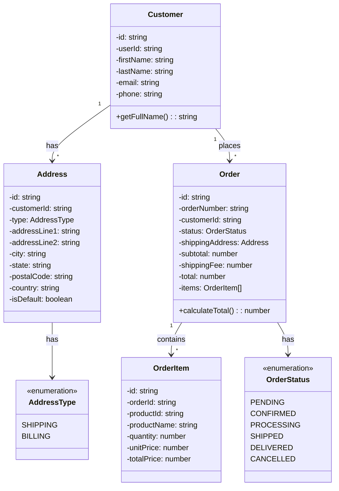
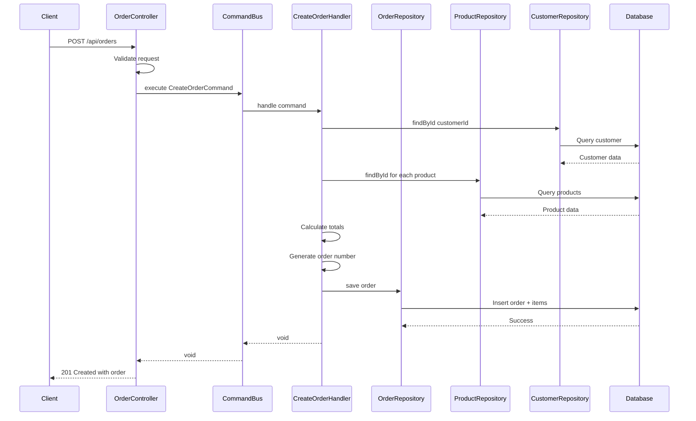

# Order Management & Customer Management Design

## Overview

This document outlines the design for implementing Order Management and Customer Management features for the solar-backend application. Payments are handled externally (on delivery), so the system only tracks order status updates by admin.

---

## Part 1: Customer Management

### Database Schema

#### Customers Table
```sql
CREATE TABLE customers (
    id UUID PRIMARY KEY,
    user_id UUID REFERENCES users(id) ON DELETE SET NULL,
    first_name VARCHAR(100) NOT NULL,
    last_name VARCHAR(100) NOT NULL,
    email VARCHAR(255) NOT NULL UNIQUE,
    phone VARCHAR(20),
    created_at TIMESTAMP,
    updated_at TIMESTAMP
);
```

#### Addresses Table
```sql
CREATE TABLE addresses (
    id UUID PRIMARY KEY,
    customer_id UUID REFERENCES customers(id) ON DELETE CASCADE,
    type VARCHAR(20) NOT NULL, -- 'shipping', 'billing'
    address_line1 VARCHAR(255) NOT NULL,
    address_line2 VARCHAR(255),
    city VARCHAR(100) NOT NULL,
    state VARCHAR(100),
    postal_code VARCHAR(20),
    country VARCHAR(100) NOT NULL,
    is_default BOOLEAN DEFAULT FALSE,
    created_at TIMESTAMP,
    updated_at TIMESTAMP
);
```

### API Endpoints

| Method | Endpoint | Description |
|--------|----------|-------------|
| GET | `/api/customers` | List all customers (admin) |
| GET | `/api/customers/:id` | Get customer details |
| POST | `/api/customers` | Create customer profile |
| PUT | `/api/customers/:id` | Update customer profile |
| DELETE | `/api/customers/:id` | Delete customer |
| GET | `/api/customers/:id/addresses` | Get customer addresses |
| POST | `/api/customers/:id/addresses` | Add address |
| PUT | `/api/customers/:id/addresses/:addressId` | Update address |
| DELETE | `/api/customers/:id/addresses/:addressId` | Delete address |
| GET | `/api/customers/:id/orders` | Get customer order history |

---

## Part 2: Order Management

### Order Status Workflow

```
PENDING → CONFIRMED → PROCESSING → SHIPPED → DELIVERED
    ↓          ↓           ↓           ↓
  CANCELLED  CANCELLED  CANCELLED   CANCELLED
```

**Status Descriptions:**
- `PENDING` - Order created, awaiting confirmation
- `CONFIRMED` - Admin confirmed the order
- `PROCESSING` - Order is being prepared
- `SHIPPED` - Order is out for delivery
- `DELIVERED` - Order delivered and paid (payment on delivery)
- `CANCELLED` - Order cancelled

### Database Schema

#### Orders Table
```sql
CREATE TABLE orders (
    id UUID PRIMARY KEY,
    order_number VARCHAR(50) UNIQUE NOT NULL,
    customer_id UUID REFERENCES customers(id) ON DELETE SET NULL,
    status VARCHAR(20) NOT NULL DEFAULT 'PENDING',
    
    -- Shipping Address (snapshot at order time)
    shipping_address_line1 VARCHAR(255) NOT NULL,
    shipping_address_line2 VARCHAR(255),
    shipping_city VARCHAR(100) NOT NULL,
    shipping_state VARCHAR(100),
    shipping_postal_code VARCHAR(20),
    shipping_country VARCHAR(100) NOT NULL,
    
    -- Pricing
    subtotal DECIMAL(10,2) NOT NULL,
    shipping_fee DECIMAL(10,2) DEFAULT 0,
    total DECIMAL(10,2) NOT NULL,
    
    -- Notes
    customer_notes TEXT,
    admin_notes TEXT,
    
    -- Timestamps
    confirmed_at TIMESTAMP,
    shipped_at TIMESTAMP,
    delivered_at TIMESTAMP,
    cancelled_at TIMESTAMP,
    created_at TIMESTAMP,
    updated_at TIMESTAMP
);
```

#### Order Items Table
```sql
CREATE TABLE order_items (
    id UUID PRIMARY KEY,
    order_id UUID REFERENCES orders(id) ON DELETE CASCADE,
    product_id UUID REFERENCES products(id) ON DELETE SET NULL,
    product_name VARCHAR(255) NOT NULL,
    product_slug VARCHAR(255),
    quantity INTEGER NOT NULL,
    unit_price DECIMAL(10,2) NOT NULL,
    total_price DECIMAL(10,2) NOT NULL,
    created_at TIMESTAMP
);
```

### API Endpoints

| Method | Endpoint | Description |
|--------|----------|-------------|
| GET | `/api/orders` | List all orders (admin) |
| GET | `/api/orders/:id` | Get order details |
| POST | `/api/orders` | Create new order |
| PUT | `/api/orders/:id/status` | Update order status (admin) |
| POST | `/api/orders/:id/cancel` | Cancel order |
| GET | `/api/orders/status/:status` | Get orders by status |
| GET | `/api/orders/number/:orderNumber` | Get order by order number |

---

## Architecture

### Directory Structure

```
src/kernel/
├── customer/
│   ├── domain/
│   │   ├── entity/
│   │   │   ├── customer.ts
│   │   │   └── address.ts
│   │   ├── repository/
│   │   │   ├── customer_repository.ts
│   │   │   └── address_repository.ts
│   │   └── type/
│   │       └── address_type.ts
│   ├── application/
│   │   ├── command/
│   │   │   ├── create_customer_command.ts
│   │   │   ├── update_customer_command.ts
│   │   │   ├── create_address_command.ts
│   │   │   └── update_address_command.ts
│   │   └── command-handler/
│   │       ├── create_customer_handler.ts
│   │       ├── update_customer_handler.ts
│   │       ├── create_address_handler.ts
│   │       └── update_address_handler.ts
│   └── infrastructure/
│       └── persistence/
│           ├── customer_ar_repository.ts
│           └── address_ar_repository.ts
├── order/
│   ├── domain/
│   │   ├── entity/
│   │   │   ├── order.ts
│   │   │   └── order_item.ts
│   │   ├── repository/
│   │   │   └── order_repository.ts
│   │   └── type/
│   │       └── order_status.ts
│   ├── application/
│   │   ├── command/
│   │   │   ├── create_order_command.ts
│   │   │   ├── update_order_status_command.ts
│   │   │   └── cancel_order_command.ts
│   │   └── command-handler/
│   │       ├── create_order_handler.ts
│   │       ├── update_order_status_handler.ts
│   │       └── cancel_order_handler.ts
│   └── infrastructure/
│       └── persistence/
│           └── order_ar_repository.ts
```

---

## Class Diagram



---

## Sequence Diagram - Create Order



---

## Request/Response Examples

### Create Customer

**Request:**
```http
POST /api/customers
Content-Type: application/json

{
  "firstName": "John",
  "lastName": "Doe",
  "email": "john.doe@example.com",
  "phone": "+2348012345678"
}
```

**Response:**
```json
{
  "data": {
    "id": "550e8400-e29b-41d4-a716-446655440000",
    "firstName": "John",
    "lastName": "Doe",
    "email": "john.doe@example.com",
    "phone": "+2348012345678",
    "createdAt": "2026-03-04T22:00:00Z"
  }
}
```

### Create Order

**Request:**
```http
POST /api/orders
Content-Type: application/json

{
  "customerId": "550e8400-e29b-41d4-a716-446655440000",
  "items": [
    {
      "productId": "660e8400-e29b-41d4-a716-446655440001",
      "quantity": 2
    },
    {
      "productId": "660e8400-e29b-41d4-a716-446655440002",
      "quantity": 1
    }
  ],
  "shippingAddressId": "770e8400-e29b-41d4-a716-446655440003",
  "customerNotes": "Please deliver in the morning"
}
```

**Response:**
```json
{
  "data": {
    "id": "880e8400-e29b-41d4-a716-446655440004",
    "orderNumber": "ORD-20260304-0001",
    "customerId": "550e8400-e29b-41d4-a716-446655440000",
    "status": "PENDING",
    "items": [
      {
        "productId": "660e8400-e29b-41d4-a716-446655440001",
        "productName": "Solar Panel 100W",
        "quantity": 2,
        "unitPrice": 150.00,
        "totalPrice": 300.00
      },
      {
        "productId": "660e8400-e29b-41d4-a716-446655440002",
        "productName": "Solar Battery 200Ah",
        "quantity": 1,
        "unitPrice": 500.00,
        "totalPrice": 500.00
      }
    ],
    "shippingAddress": {
      "addressLine1": "123 Main Street",
      "city": "Lagos",
      "state": "Lagos",
      "country": "Nigeria"
    },
    "subtotal": 800.00,
    "shippingFee": 20.00,
    "total": 820.00,
    "customerNotes": "Please deliver in the morning",
    "createdAt": "2026-03-04T22:00:00Z"
  }
}
```

### Update Order Status

**Request:**
```http
PUT /api/orders/880e8400-e29b-41d4-a716-446655440004/status
Content-Type: application/json

{
  "status": "CONFIRMED",
  "adminNotes": "Payment confirmed via bank transfer"
}
```

**Response:**
```http
HTTP/1.1 204 No Content
```

---

## Implementation Checklist

### Customer Management
- [ ] Create customers table migration
- [ ] Create addresses table migration
- [ ] Create Customer ActiveRecord
- [ ] Create Address ActiveRecord
- [ ] Create Customer domain entity
- [ ] Create Address domain entity
- [ ] Create CustomerRepository interface
- [ ] Create AddressRepository interface
- [ ] Create CustomerARRepository
- [ ] Create AddressARRepository
- [ ] Create customer commands
- [ ] Create customer command handlers
- [ ] Create CustomerController
- [ ] Create customer validators
- [ ] Register in providers

### Order Management
- [ ] Create orders table migration
- [ ] Create order_items table migration
- [ ] Create Order ActiveRecord
- [ ] Create OrderItem ActiveRecord
- [ ] Create Order domain entity
- [ ] Create OrderItem domain entity
- [ ] Create OrderStatus enum
- [ ] Create OrderRepository interface
- [ ] Create OrderARRepository
- [ ] Create order commands
- [ ] Create order command handlers
- [ ] Create OrderController
- [ ] Create order validators
- [ ] Register in providers
- [ ] Add routes

---

## Notes

1. **Order Number Generation**: Format `ORD-YYYYMMDD-XXXX` where XXXX is a sequential number for that day.

2. **Stock Deduction**: Stock will be deducted when order status changes to `CONFIRMED`.

3. **Address Snapshot**: Shipping address is copied to the order at creation time to preserve history even if customer updates their address later.

4. **Soft Delete**: Consider implementing soft delete for customers and orders to maintain order history.

5. **Validation**: 
   - Validate product availability before order creation
   - Validate stock quantity before confirming order
   - Prevent status transitions that skip steps (e.g., PENDING directly to SHIPPED)
