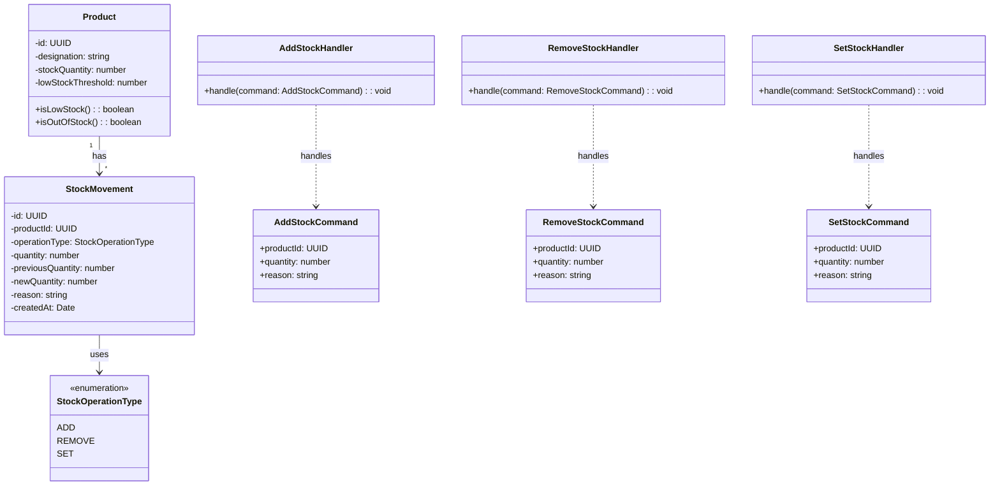
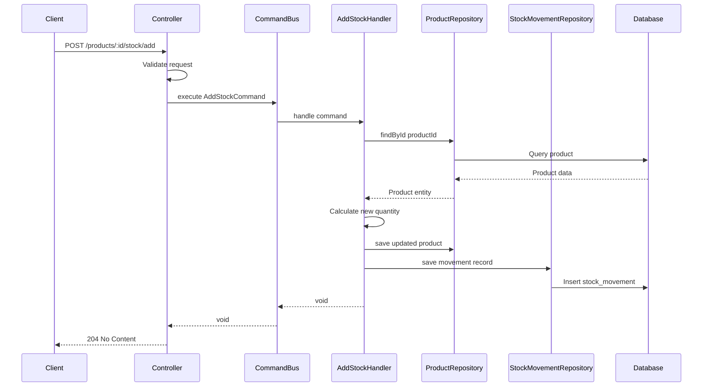

# Product Stock Management Feature Design

## Overview

This document outlines the design for implementing a Product Stock Management feature in the solar-backend application. The design follows the existing CQRS architecture pattern and Domain-Driven Design principles used throughout the codebase.

## Current Architecture Analysis

The existing codebase follows these patterns:

- **CQRS Pattern**: Commands and Command Handlers separated from queries
- **Domain-Driven Design**: Entities, Repositories, and Domain layers
- **Active Record Pattern**: Lucid ORM for database operations
- **Dependency Injection**: Via AdonisJS container

### Key Files Referenced

- [`Product Entity`](src/kernel/product/domain/entity/product.ts) - Domain entity
- [`Product Repository Interface`](src/kernel/product/domain/repository/product_repository.ts) - Repository contract
- [`Product AR Repository`](src/kernel/product/infrastructure/persistence/product_ar_repository.ts) - Implementation
- [`Product ActiveRecord`](database/active-records/product.ts) - Database model
- [`Command Bus`](src/shared/infrastructure/bus/command_bus.ts) - CQRS implementation
- [`CQRS Provider`](providers/cqrs_provider.ts) - Handler registration

## Feature Requirements

### Core Functionality

1. **Stock Quantity Tracking**: Track available quantity for each product
2. **Stock Operations**: Add stock, remove stock, set stock level
3. **Low Stock Alerts**: Threshold-based low stock warnings
4. **Stock History**: Track stock movement history
5. **Availability Management**: Auto-update product availability based on stock

### API Endpoints

| Method | Endpoint | Description |
|--------|----------|-------------|
| GET | `/products/:id/stock` | Get current stock level |
| POST | `/products/:id/stock/add` | Add stock quantity |
| POST | `/products/:id/stock/remove` | Remove stock quantity |
| PUT | `/products/:id/stock` | Set absolute stock level |
| GET | `/products/:id/stock/history` | Get stock movement history |
| GET | `/products/low-stock` | List products below threshold |

## Architecture Design

### Domain Layer

```
src/kernel/product/
├── domain/
│   ├── entity/
│   │   ├── product.ts (modified)
│   │   └── stock_movement.ts (new)
│   ├── repository/
│   │   ├── product_repository.ts (modified)
│   │   └── stock_movement_repository.ts (new)
│   └── type/
│       └── stock_operation_type.ts (new)
├── application/
│   ├── command/
│   │   ├── add_stock_command.ts (new)
│   │   ├── remove_stock_command.ts (new)
│   │   └── set_stock_command.ts (new)
│   └── command-handler/
│       ├── add_stock_handler.ts (new)
│       ├── remove_stock_handler.ts (new)
│       └── set_stock_handler.ts (new)
└── infrastructure/
    └── persistence/
        ├── product_ar_repository.ts (modified)
        └── stock_movement_ar_repository.ts (new)
```

### Database Schema

#### Modify Products Table

```sql
ALTER TABLE products ADD COLUMN stock_quantity INTEGER NOT NULL DEFAULT 0;
ALTER TABLE products ADD COLUMN low_stock_threshold INTEGER NOT NULL DEFAULT 10;
```

#### Create Stock Movements Table

```sql
CREATE TABLE stock_movements (
    id UUID PRIMARY KEY,
    product_id UUID REFERENCES products(id) ON DELETE CASCADE,
    operation_type VARCHAR(20) NOT NULL, -- ADD, REMOVE, SET
    quantity INTEGER NOT NULL,
    previous_quantity INTEGER NOT NULL,
    new_quantity INTEGER NOT NULL,
    reason VARCHAR(255),
    created_at TIMESTAMP,
    created_by UUID REFERENCES users(id)
);
```

### Class Diagram



### Sequence Diagram - Add Stock Operation



## Implementation Details

### 1. Domain Entity - Stock Movement

```typescript
// src/kernel/product/domain/entity/stock_movement.ts
export enum StockOperationType {
  ADD = 'ADD',
  REMOVE = 'REMOVE',
  SET = 'SET',
}

export class StockMovement {
  constructor(
    private id: string,
    private productId: string,
    private operationType: StockOperationType,
    private quantity: number,
    private previousQuantity: number,
    private newQuantity: number,
    private reason?: string,
    private createdAt?: Date,
    private createdBy?: string
  ) {}
  
  // Getters...
}
```

### 2. Commands

```typescript
// src/kernel/product/application/command/add_stock_command.ts
export class AddStockCommand implements Command {
  readonly timestamp: Date
  
  constructor(
    public readonly productId: string,
    public readonly quantity: number,
    public readonly reason?: string
  ) {
    this.timestamp = new Date()
  }
}
```

### 3. Command Handlers

```typescript
// src/kernel/product/application/command-handler/add_stock_handler.ts
export class AddStockHandler implements CommandHandler<AddStockCommand> {
  constructor(
    private productRepository: ProductRepository,
    private stockMovementRepository: StockMovementRepository
  ) {}
  
  async handle(command: AddStockCommand): Promise<void> {
    const product = await this.productRepository.findById(command.productId)
    const previousQuantity = product.getStockQuantity()
    const newQuantity = previousQuantity + command.quantity
    
    product.setStockQuantity(newQuantity)
    await this.productRepository.save(product)
    
    const movement = new StockMovement(
      null,
      command.productId,
      StockOperationType.ADD,
      command.quantity,
      previousQuantity,
      newQuantity,
      command.reason
    )
    await this.stockMovementRepository.save(movement)
  }
}
```

### 4. Controller

```typescript
// app/controllers/product/stock_controller.ts
export default class StockController extends AppAbstractController {
  public async add({ request, response }: HttpContext) {
    const productId = request.param('id')
    const payload = await request.validateUsing(addStockSchema)
    
    await this.handleCommand(
      new AddStockCommand(productId, payload.quantity, payload.reason)
    )
    
    return response.noContent()
  }
  
  // Additional methods...
}
```

### 5. Provider Registration

```typescript
// providers/cqrs_provider.ts
commandBus.register('AddStockCommand', AddStockHandler, [
  'ProductRepository',
  'StockMovementRepository'
])
commandBus.register('RemoveStockCommand', RemoveStockHandler, [
  'ProductRepository',
  'StockMovementRepository'
])
commandBus.register('SetStockCommand', SetStockHandler, [
  'ProductRepository',
  'StockMovementRepository'
])
```

```typescript
// providers/repository_provider.ts
this.app.container.bind('StockMovementRepository', () => {
  return new StockMovementARRepository()
})
```

## Files to Create/Modify

### New Files

| File Path | Description |
|-----------|-------------|
| `database/migrations/xxxx_add_stock_to_products.ts` | Migration to add stock columns |
| `database/migrations/xxxx_create_stock_movements_table.ts` | Migration for stock movements |
| `database/active-records/stock_movement.ts` | ActiveRecord model |
| `src/kernel/product/domain/entity/stock_movement.ts` | Domain entity |
| `src/kernel/product/domain/repository/stock_movement_repository.ts` | Repository interface |
| `src/kernel/product/domain/type/stock_operation_type.ts` | Enum type |
| `src/kernel/product/application/command/add_stock_command.ts` | Add stock command |
| `src/kernel/product/application/command/remove_stock_command.ts` | Remove stock command |
| `src/kernel/product/application/command/set_stock_command.ts` | Set stock command |
| `src/kernel/product/application/command-handler/add_stock_handler.ts` | Handler |
| `src/kernel/product/application/command-handler/remove_stock_handler.ts` | Handler |
| `src/kernel/product/application/command-handler/set_stock_handler.ts` | Handler |
| `src/kernel/product/infrastructure/persistence/stock_movement_ar_repository.ts` | Repository impl |
| `app/controllers/product/stock_controller.ts` | Controller |
| `app/validators/stock_validator.ts` | Validation schemas |

### Modified Files

| File Path | Changes |
|-----------|---------|
| `database/active-records/product.ts` | Add stock columns |
| `src/kernel/product/domain/entity/product.ts` | Add stock properties and methods |
| `src/kernel/product/domain/repository/product_repository.ts` | Add stock-related methods |
| `src/kernel/product/infrastructure/persistence/product_ar_repository.ts` | Implement stock methods |
| `providers/cqrs_provider.ts` | Register new handlers |
| `providers/repository_provider.ts` | Register new repository |
| `app/validators/product_validator.ts` | Add stock validation |
| `start/routes.ts` | Add stock routes |

## API Request/Response Examples

### Add Stock

**Request:**
```http
POST /products/550e8400-e29b-41d4-a716-446655440000/stock/add
Content-Type: application/json

{
  "quantity": 50,
  "reason": "New inventory received"
}
```

**Response:**
```http
HTTP/1.1 204 No Content
```

### Get Stock

**Request:**
```http
GET /products/550e8400-e29b-41d4-a716-446655440000/stock
```

**Response:**
```json
{
  "data": {
    "productId": "550e8400-e29b-41d4-a716-446655440000",
    "quantity": 150,
    "lowStockThreshold": 10,
    "isLowStock": false,
    "isOutOfStock": false
  }
}
```

### Get Stock History

**Request:**
```http
GET /products/550e8400-e29b-41d4-a716-446655440000/stock/history?page=1&limit=20
```

**Response:**
```json
{
  "meta": {
    "total": 45,
    "perPage": 20,
    "currentPage": 1,
    "lastPage": 3
  },
  "data": [
    {
      "id": "660e8400-e29b-41d4-a716-446655440001",
      "operationType": "ADD",
      "quantity": 50,
      "previousQuantity": 100,
      "newQuantity": 150,
      "reason": "New inventory received",
      "createdAt": "2026-03-04T10:30:00Z"
    }
  ]
}
```

## Questions for Clarification

Before proceeding with implementation, please clarify:

1. **User Tracking**: Should stock movements track which user made the change? This would require the user ID in the command.

2. **Negative Stock**: Should the system allow negative stock quantities for backorders, or should it prevent stock from going below zero?

3. **Auto-Availability**: Should `isAvailable` on the product automatically update based on stock quantity? For example, set to `false` when stock reaches 0.

4. **Stock Reservation**: Do you need stock reservation functionality for shopping carts/orders? This would require additional complexity.

5. **Audit Trail**: Should stock movements be immutable, or can they be edited/deleted?

6. **Threshold Management**: Should low stock threshold be per-product or have a global default?

---

*Please review this design and provide feedback or approval to proceed with implementation.*
